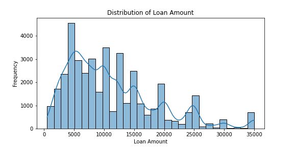
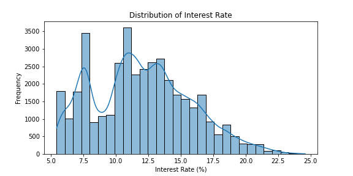
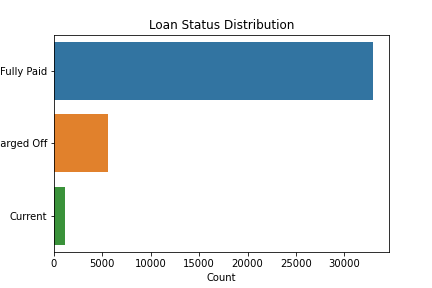
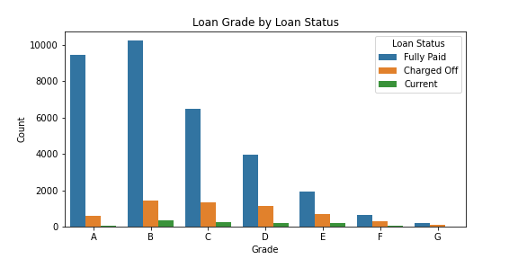
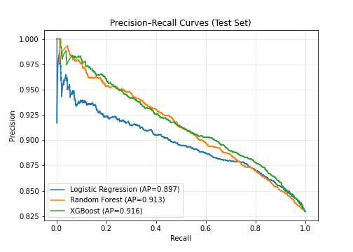

# Digitizing Loan Approvals for Financial Inclusion: A Machine Learning Approach for Kenyan Microfinance Institutions (MFI's) and Digital Lenders

## Business Problem
Kenyan microfinance institutions (MFIs) and digital lenders face challenges in automating loan approvals, reducing manual delays, and improving fairness for underserved groups. This project delivers a machine learning solution that predicts loan approval using both financial and behavioral (sentiment) data, supporting digital transformation and financial inclusion.

## Solution Overview
- **Automated loan approval** using XGBoost and sentiment analysis
- **Sentiment features** extracted from applicant descriptions using VADER
- **Robust feature engineering**: loan-to-income ratio, debt-to-income ratio, outlier capping
- **Business insights**: visualizations and explainable predictions

## Data & Features
- **Source**: Real-world loan application data
- **Key features**: loan amount, term, interest rate, grade, employment length, home ownership, annual income, purpose, loan-to-income ratio, DTI, sentiment score
- **Target**: Loan approval status (Approved/Not Approved)

## Workflow

1. **Data Cleaning & EDA**
   - Drop columns with excessive missing values
   - Visualize distributions (loan amount, interest rate, loan status, loan grade by loan status, loan amount by loan status)
   - Example:

   

   

   

    

2. **Feature Engineering**
   - Create ratio features (loan-to-income, DTI)
   - Encode categorical variables
   - Cap outliers
   - Integrate sentiment features:
     - VADER compound score from applicant description
     - Sentiment mapped to positive/neutral/negative

3. **Modeling**
   - Train/test split
   - Handle class imbalance with SMOTE
   - Models - Logistic Regression, Random Forest, XGBoost, Stacking ensemble
   - Evaluate with ROC-AUC, PR-AUC, F1-score
     

4. **Deployment**
   - Flask API for real-time predictions
   - Heroku deployment guide
   - `/predict` endpoint accepts JSON and returns approval decision, probability, and sentiment analysis

## Sentiment Analysis Impact
- Sentiment features help capture applicant optimism, distress, or intent
- Rule-based override: highly negative sentiment can auto-reject applications
- Business value: improves fairness, flags risky applications, and supports responsible lending

# How to Run the Entire Notebook

To execute all cells in the notebook and generate all outputs and visualizations:

1. Open `Loan_approval_final.ipynb` in Jupyter Notebook, JupyterLab, or VS Code.
2. Select "Run All" from the menu (usually under `Cell > Run All` or the run-all icon).
3. Wait for all cells to finish executing. This will:
   - Process the data
   - Engineer features
   - Train and evaluate models
   - Generate and save all plots to the `images/` folder
   - Output predictions and explanations

**Tip:** If you encounter any errors, make sure all dependencies are installed (see the section on installing dependencies) and restart the kernel before running all cells again.

## Visualizations
- Loan amount, Interest rate, Loan status, Loan grade by loan status, PR curve.
- Use provided notebook code to generate and save plots in an `images/` folder for documentation

## Authors & Acknowledgements
- Built by [Valentine, Beatrice, Shem, Sharon, Nelson & Mercy]
- Inspired by Kenya’s financial inclusion mission and digital transformation
- Data and business context from Kenyan MFIs and digital lenders